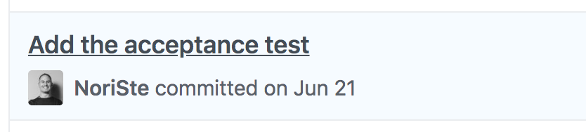

<!--
TODO: link this post from Medium
TODO: set the canonical link on Medium, dev.to etc to point here
-->

I'm working on a big
[UI Testing Best Practices](https://github.com/NoriSte/ui-testing-best-practices)
project on GitHub, I share this post to spread it and have direct
feedback.  You can read the post here,
[on Medium](https://medium.com/@NoriSte/front-end-productivity-boost-cypress-as-your-main-development-browser-f08721123498)
or
[on dev.to](https://dev.to/noriste/front-end-productivity-boost-cypress-as-your-main-development-browser-5cdk).

---

Do you test your front-end manually? If you test it with some E2E tests, do you
write the tests as your last step? Yes? this article is for you! 🙌 Are you a
TDD developer? Don’t read it, you lose your time 😉

[Cypress](https://www.cypress.io) is known because of its E2E testing
effectiveness. It has some limitations, obviously, but it’s clearly created to
bring E2E testing to another level. In this post, I’d like to share how you
could use **Cypress as your main development browser**, not only as a testing
tool.

[TDD](https://www.wikiwand.com/en/Test-driven_development) developers are
already practiced to leverage their testing tools as much as they can. If you do
not apply a strict TDD approach, do not worry, this post **is about productivity
only**. And if you do not test your front-end application because you “do not
have time”, I hope to change your mind!

Let’s analyze how we, as front-end developers, usually work while developing the
evergreen _authentication form_ example:

- we code the username input field
- we try it manually through the browser
- we eventually fix it
- then, we code the password input field
- we try it manually through the browser
- then, we add the submit button
- we code the AJAX request management

Please note that, at this point, we probably have already added some default
values to the input fields to avoid filling them manually at every CTRL+S…
Anyway: we try the whole form through the browser, inspecting that the AJAX call
has been made and that it sends the right payload to the server

- since we need to check if error paths are managed correctly, we force the
  request-making function to return a static response containing an error
  (probably we are searching on StackOverflow how to simulate a wrong network
  response with Axios…)
- we check that the app behaves as expected in the error cases
- we slow down the network speed to check how an AJAX delay could affect the
  user experience
- in the end, we re-check everything to be sure that the recent changes did not
  break the already-tested flows

I **shortened the steps** for the sake of this article because for every above
step you probably need 5 to 20 changes + form fill etc. The smartest of us use
some Chrome DevTools snippets to speed up the process, add some scripts to the
source code to present the UI directly at the desired point (if the code of the
view is well decoupled from the rest of the application). Some of us add a lot
of conditions to prevent that some changes are effective even while the site
goes online… Adding a lot of garbage code in the codebase…

_If you already write E2E tests, **skip the next chapter**!_

## The power of a testing tool

If you are not a tester and if the above description matches the way you work… I
have good news for you: a made-on-purpose testing tool like
[Cypress](https://www.cypress.io) (or
[TestCafé](https://devexpress.github.io/testcafe/), but please do not consider
generic browser automation tools like Selenium or Puppeteer) simplifies every
working step! Without making your source code dirty! Because

- you do not need to hardcode input field default values, an automated browser
  interacts with the page at a blazing speed. Take a look at some tests of mines
  to understand what I mean with _blazing_

<iframe width="100%" height="315" src="https://www.youtube.com/embed/lNEMKeTYEPI" frameborder="0" allowfullscreen></iframe>

- you do not need to simulate strange network behaviors because Cypress allows
  you to simulate them
  [from a browser perspective](https://docs.cypress.io/api/commands/route.html),
  not from a code perspective. Your front-end app performs a standard AJAX call
  ignoring that Cypress is responding with what you specified (you can specify
  the response, the network status, a network delay, etc.)
- Cypress controls a Chrome browser, you can leverage the **DevTools** you are
  already used to
- Cypress creates a dedicated and persisted Chrome user, so you can install your
  favorite **Chrome extensions** (like the React and Redux DevTools)

[ repo)](./images/devtools.jpg)](https://github.com/NoriSte/cypress-react-devtools)_The
React and Redux DevTools in action with Cypress (from the
[cypress-react-devtools](https://github.com/NoriSte/cypress-react-devtools)
repo_

- you can add a lot of assertions to have an immediate green/red feedback. An
  assertion is a sort of English-based guard in the form of, for example: “_I
  expect that the form passes the username and the password as the payload for
  the AJAX request_”
- you do not need to go back and forth testing manually both the latest
  implemented flow and the previous ones: once you have replicated a flow with a
  Cypress test, it’s here to stay. If you change the code accidentally breaking
  a previous flow, Cypress warns you!
- if you heard that E2E tests are slow, read what
  [UI Integration tests](https://github.com/NoriSte/ui-testing-best-practices/blob/master/sections/testing-strategy/component-vs-integration-vs-e2e-testing.md)
  are

## Do you already E2E test your front-end?

Kudos 👍 only one question: do you write the tests only when you’re sure that
everything works correctly? That’s the point! When you write a test, you
instrument your testing tool to repeat what you’ve done manually! The same,
exact, actions:

- filling a form
- clicking buttons
- asserting some elements exist or are visible
- checking the
  [AJAX request payload](https://github.com/NoriSte/ui-testing-best-practices/blob/master/sections/server-communication-testing/test-request-and-response-payload.md)

Why do you do that? Because when you test manually you have more freedom!
Because you can choose the flow you want to test, because you can leverage the
browser extensions and the React/Vue.js etc. DevTools, because you can access
the Chrome DevTools etc.

## How I leverage Cypress as my main development browser

Take a look at the
[repository](https://github.com/NoriSte/working-software-mastering-ui-testing) I
prepared for the
[Working Software Conference](https://www.agilemovement.it/workingsoftware/).
The fourth commit (before all the front-end related commits) is the following:

_An
outside-in acceptance E2E test_

and, while coding the front-end “app” (it was a demo, a single-component app) I
have **never interacted manually** with the front-end. I testes it manually only
when I finished developing it. How?

- first of all: open Cypress and place it in your second monitor
- open a Chrome of yours with Cypress and check that the DevTools you need are
  installed
- install the
  [skip-and-only-ui](https://github.com/bahmutov/cypress-skip-and-only-ui)
  plugin for Cypress, it helps you to run a single test, skip some tests, etc.
  directly from the Cypress UI

[ plugin in action](./images/skip-and-only-ui.gif)](https://github.com/bahmutov/cypress-skip-and-only-ui)_ The
[cypress-skip-and-only](https://github.com/bahmutov/cypress-skip-and-only-ui)
plugin in action_

- install the
  [watch-and-reload](https://github.com/bahmutov/cypress-watch-and-reload)
  plugin for Cypress, you can configure it to re-launch the Cypress tests on
  every CTRL+S of your source file
- write the first interaction in the Cypress test: speaking about the
  authentication form, the username input filling. If you are so good to be able
  to write the full test, kudos again!
- start writing the source code of your front-end. The watch-and-reload plugin
  re-run the Cypress test without you leave the code editor

Please, stop on the last point: you hit CTRL+S and Cypress, without any manual
interaction! And it’s faster and faster than you! Think about the amount of work
it avoids you! Let’s continue:

- as soon as everything works, write the next interaction in the Cypress test
  and code your app to make the test work
- as soon as you need to check a different flow (AJAX 500 response, 401
  response, 403 response, no network, etc.), duplicate the test and leverage the
  Cypress APIs to simulate it (like _cy.route_)
- repeat the flow until you are done

Well done 😊 and please, share your feedback to help other developers make this
productivity switch 💪

## Summing up

The advantages of leveraging Cypress (and the plugin cited above)as your main
development browser are:

- you reduce manual, and slow, testing to the bare minimum saving you a lot of
  time
- in the end, your app is automatically tested and the tests will remain forever
- you avoid completely the “annoying” process of writing the test after you have
  coded your flow
- you avoid adding temporary states and fake returns into your source code

Some more articles about the topic:

- [Component vs (UI) Integration vs E2E tests](/blog/component-vs-integration-vs-e2e-tests)
- [Await, do not make your E2E tests sleep](/blog/await-dont-sleep-your-e2e-tests)
