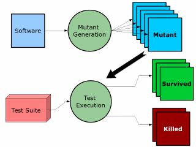
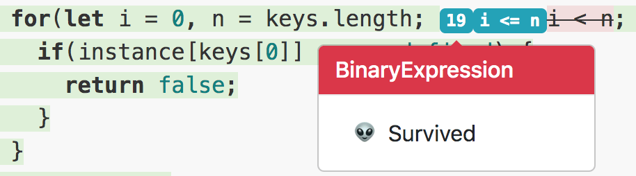
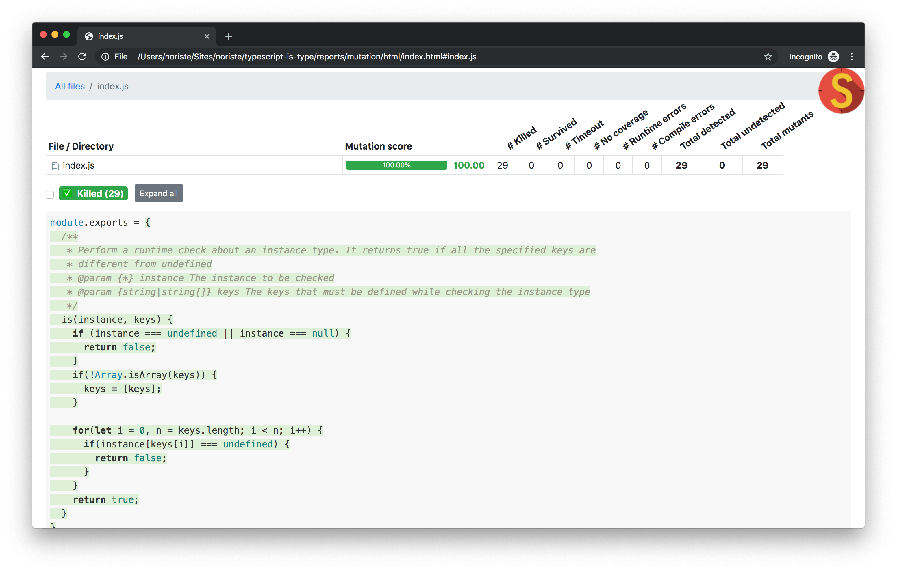

<!--
TODO: link this post from Medium
TODO: set the canonical link on Medium, dev.to etc to point here
-->

You can read the post here,
[on Medium](https://medium.com/@NoriSte/who-watches-the-watchmen-mutation-testing-in-action-4c56e014631)
or
[on dev.to](https://dev.to/noriste/who-watches-the-watchmen-mutation-testing-in-action-3889).

---

_Credits for the title go to [Yoni Goldberg](http://goldbergyoni.com). I love it
because it gets the homonym and
[amazing graphic novel](https://it.wikipedia.org/wiki/Watchmen) come to my
mind.<br />_

So, you're developing a new function and it needs a lot of unit tests (like my
[Bitcoin address regex validation](https://github.com/NoriSte/bitcoin-address-soft-regex-validation)).
Tell me: how could you judge the effectiveness of your tests? Are you sure that
you're testing every feature with all the necessary corner cases? What makes you
so confident?<br/> I know the answer:
[Code Coverage](https://www.wikiwand.com/en/Code_coverage) and experience.

Two considerations:

- code coverage does not work for measuring the effectiveness of the tests. Code
  coverage helps you finding untested cases and it's pretty good at that. But it
  can't tell you anything about the **quality** of your code. You can leave a
  huge number of bugs into the source code and code coverage helps you only to
  pass through all of these bugs, not to solve them. You can argue that bugs
  must be discovered by tests but...
- testing requires experience, you do not write your best test right when you
  start doing it. The more experience you gain, the more doubts come to your
  mind asking yourself "Am I sure that these tests are really testing my
  function?"

Do not worry, it's a road already traveled. The more you gain experience, the
more you know that your code is not perfect, that's why you started testing
after all... And the more you test, the more you want to be sure that your tests
are effective.

Quoting a colleague of mine (Hi [Mirko](https://www.linkedin.com/in/fcracker79/)
👋):

> Sometimes I introduce mutations to be confident about my tests

## Mutation Testing

Checking that your tests are effective is pretty straightforward: place some
bugs into your code and launch the tests. If the tests do not fail, they are
useless to catch the bug. This is mutation testing! You mutate the source code
(this newly and bugged source code is called "a mutant") and you launch the test
suite against it.

In fact, the main goals of
[Mutation Testing](https://en.wikipedia.org/wiki/Mutation_testing) are:

- identify weakly tested pieces of code (those for which mutants are not killed)
- identify weak tests (those that never kill mutants)

[](https://en.wikipedia.org/wiki/Mutation_testing)_Mutation
Testing_

If you think that we're speaking about some testing freaks... Go ahead 😊

## An example

I chose to play with Mutation Testing with an old package of mine:
[Typescript Is Type](https://github.com/NoriSte/typescript-is-type). The whole
package is pretty small, below the source code

```javascript
module.exports = {
  /**
   * Perform a runtime check about an instance type. It returns true if all the specified keys are
   * different from undefined
   * @param {*} instance The instance to be checked
   * @param {string|string[]} keys The keys that must be defined while checking the instance type
   */
  is(instance, keys) {
    if (instance === undefined || instance === null) {
      return false
    }
    if (!Array.isArray(keys)) {
      keys = [keys]
    }

    for (let i = 0, n = keys.length; i < n; i++) {
      if (instance[keys[0]] === undefined) {
        return false
      }
    }
    return true
  },
}
```

Do you see the giant bug?

I installed [Stryker](https://stryker-mutator.io) that manages all the process
of mutating my source code and launching the tests suite automatically.

Please, note: the Stryker installation is
[pretty straightforward](https://stryker-mutator.io/stryker/quickstart), then
you only need to add the files you want it to mutate through the
[Stryker configuration](https://github.com/stryker-mutator/stryker/tree/master/packages/core#mutate-string).
In my case it was just `mutate: ["index.js"]`.

Once launched Styker with `npx styker run` I found a surprise, a mutant was
survived



Stryker was telling me that if it mutated `i < n` with `i <= n` nothing changed
from a testing point of view. The tests did not kill this mutant (the test
passed both with `i < n` or the `i <= n` mutation). How could it be possible?
How could the loop condition not influence on the tests? 🤔 Well, because of a
giant bug! Take a look at the `instance[keys[0]]`! It did not use the `i`
variable!!!

Ok, shit happens, let's analyze it:

- code coverage did not help to find the bug because, as I told at the beginning
  of the article, it can not check the quality of the code, it checks just that
  the tests pass through all the lines of code
- my tests were not so well, after all. Bugs can happen, both in the source code
  and in the tests

## How I fixed it

The subject of mutation testing is not the source code but the tests themselves.
And if my tests allowed a giant bug like the discovered one, I need to improve
them.

I added some more tests and expectations that really test the missing feature
(checking all the keys, not only the first one). Without changing the source
code, I had now some failing tests, as expected! Then, I fixed the bug and the
tests passed, perfect! I run Stryker again and everything is now fine



Long life to Mutation Testing 😊

## Conclusions

The more you test, the more you need to know if your tests are effective.
Stryker is not perfect yet (for example: you can not ignore some lines at the
moment, like some various `console.log`) but it's a good tool to catch bugs,
improve your testing confidence, and making you code better tested.

I discovered the Mutation Testing topic while following
[Yoni Goldberg](http://goldbergyoni.com) and watching his
[Advanced Node.js testing: beyond unit & integration tests (2019)](https://youtu.be/-2zP494wdUY)
video, take a look at him contents 😉

<center><iframe width="100%" height="315" src="https://www.youtube.com/embed/-2zP494wdUY" frameborder="0" allow="accelerometer; autoplay; encrypted-media; gyroscope; picture-in-picture" allowfullscreen></iframe></center>
